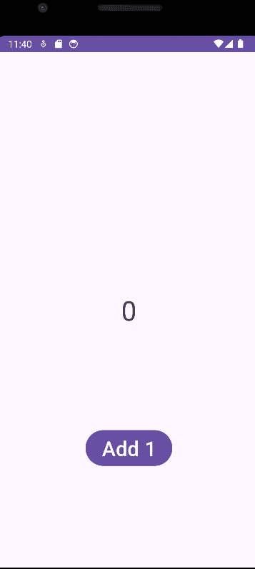

# Android Prework - *SimpleCounter*

Submitted by: **Jalen Olsen**

**SimpleCounter** is an android app that counts up everytime a button is pressed. 

Time spent: **1** hours spent in total

## Required Features

The following **required** functionality is completed:

* [X] User can see a number displayed on the screen. The number starts at 0.
* [X] User can tap on a button to see the number displayed increase by 1.

The following **optional** features are implemented:

* [ ] User can exchange number of taps accumulated for upgrades:
        Ideas for possible upgrades:
        User can exchange 100 taps for an upgrade where each tap will count as 2 taps
        User can exchange 100 taps for an icon button instead of the standard one.
* [ ] Customize the app with a theme. For example, you can have a dog background and a paw print button to give your app a dog theme.

## Video Walkthrough

Here's a walkthrough of implemented features:

<!-- Replace this with whatever GIF tool you used! -->
GIF created with ScreenToGif  
<!-- Recommended tools:
[Kap](https://getkap.co/) for macOS
[ScreenToGif](https://www.screentogif.com/) for Windows
[peek](https://github.com/phw/peek) for Linux. -->

## Notes

Only issues had were having to declare Git username and email in Bash or else the project would share to Github but would be unable to be accessed.

## License

    Copyright [yyyy] [name of copyright owner]

    Licensed under the Apache License, Version 2.0 (the "License");
    you may not use this file except in compliance with the License.
    You may obtain a copy of the License at

        http://www.apache.org/licenses/LICENSE-2.0

    Unless required by applicable law or agreed to in writing, software
    distributed under the License is distributed on an "AS IS" BASIS,
    WITHOUT WARRANTIES OR CONDITIONS OF ANY KIND, either express or implied.
    See the License for the specific language governing permissions and
    limitations under the License.
